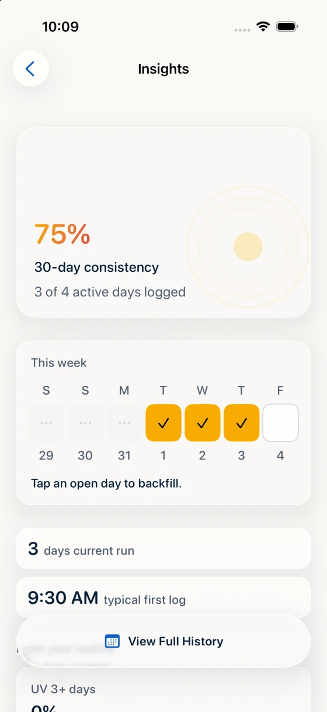
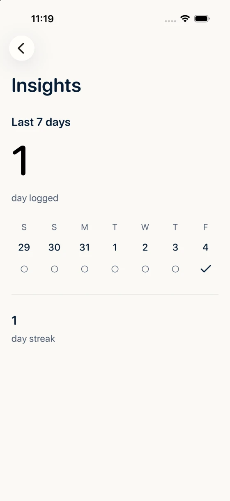

# UI simplicity verification

Status: implementation is in final verification. Native swipe input follow-ups and limitations are recorded below. Fresh exact-head full CI and review are required before merge; final evidence is recorded in the pull request.

## Local verification

Xcode 26.6.0, iPhone 17 Pro simulator on iOS 26.5; compile cache disabled. UI tests run serially. Expected-failure reruns disable verbose sysdiagnose collection, not test assertions or result bundles. Compatibility tests use an iPhone SE (3rd generation), iOS 18.6, and a separate test build with `IPHONEOS_DEPLOYMENT_TARGET=18.0`; the ordinary test bundle targets the current SDK. The app's shipped deployment settings are unchanged.

| Check                             | Result                                              |
| --------------------------------- | --------------------------------------------------- |
| Full unit suite                   | 560 passed, 0 failures after recovery follow-up (September 5) |
| Python suite                      | 279 passed, 0 failures (September 5)                |
| Website build and validation      | Passed                                              |
| CI lint                           | Passed; 0 errors, 54 SwiftLint warnings             |
| Full UI suite with final input follow-up | 79 passed, 0 failures on `bf059e4` (September 5); subsequent recovery changes require fresh full CI |
| Affected navigation follow-up      | 3/3 passed: cancelled/completed swipe with selected date, Forecast and Recovery |
| Full-travel back-swipe repetitions | Insights 20/20 passed; unchanged shorter-input control also passed 20/20 locally |
| iOS 18.6 compatibility UI suite   | Original 14/14; final Back/swipe/cancelled-gesture follow-up 2/2 |
| Development and Production builds | Both passed                                         |
| Source review                     | Review findings reproduced; follow-up validation below |
| Exact-head full CI                | Required before merge; evidence in the pull request |

## Screenshots

Real simulator captures; test fixtures and capture dates differ. Compare layout, not numerical totals.

| Insights before                                                 | Insights after                                                  |
| --------------------------------------------------------------- | --------------------------------------------------------------- |
|  |  |

- [Today saved receipt](assets/ui-simplicity/today-receipt.webp)
- [Insights in dark mode](assets/ui-simplicity/insights-dark.webp)
- [Insights at accessibility text size](assets/ui-simplicity/insights-accessibility.webp)
- [Today on iPhone SE, iOS 18.6](assets/ui-simplicity/today-narrow.webp)
- [Accessible Insights on iPhone SE, iOS 18.6](assets/ui-simplicity/insights-narrow-accessibility.webp)
- The website's logging and Shortcuts previews also use new simulator captures.

## Acceptance coverage

Today logs the current local day with a single action and guarded Undo/Edit. History alone selects dates. Insights contains a read-only seven-day summary and current streak. Three native tabs retain independent stacks; iOS 26 uses native back navigation and older systems retain a stack-scoped edge fallback.

| #   | Additional acceptance item                                    | Regression evidence                                                 |
| --- | ------------------------------------------------------------- | ------------------------------------------------------------------- |
| 1   | Clearing SPF persists                                         | ManualLogSimplicityTests                                            |
| 2   | Editor date is fixed                                          | ManualLogSimplicityTests; History UI flows                          |
| 3   | Long notes preserve coverage without truncation               | ManualLogSimplicityTests                                            |
| 4   | Ordinary `Areas:` prose survives                              | ManualLogSimplicityTests                                            |
| 5   | Older records do not acquire invented coverage                | ManualLogSimplicityTests                                            |
| 6   | Coverage is optional                                          | ManualLogSimplicityTests; shared editor                             |
| 7   | Suggestions hide metadata; explicit reuse updates fields      | ManualLogSimplicityTests; smart-reuse UI flow                       |
| 8   | Unchanged Save has no success/reminder effects                | ManualLogSimplicityTests; RecoverySimplicityTests                   |
| 9   | Reapplication rows are informational; one Edit log action     | History grouped-application UI flow                                 |
| 10  | Stale Delete Undo cannot replace newer logs                   | ManualLogSimplicityTests; RecoverySimplicityTests                   |
| 11  | One shared editor                                             | Manual Log, History, notification and URL UI flows                  |
| 12  | Resolve route context before presenting the editor            | QuietGlassNavigationTests; route UI flows                           |
| 13  | Health reflects actual write authorization and late responses | HealthKitAuthorizationTests; RecoverySimplicityTests                |
| 14  | Location switch says Use current location                     | SettingsSimplicityTests; Settings UI                                |
| 15  | One Reminders destination; diagnostics under Troubleshoot     | AutomationSettingsRouteTests; Settings UI                           |
| 16  | Location is optional during onboarding                        | Onboarding and city-selection UI flows                              |
| 17  | Save and notification onboarding failures remain distinct     | OnboardingPresentationTests; hosted failure Retry/Continue UI tests |
| 18  | Last logged uses the latest application                       | SettingsSimplicityTests                                             |
| 19  | Failed conflict Undo leaves conflict unresolved               | RecoverySimplicityTests                                             |
| 20  | Recovery errors are observable and retryable                  | RecoverySimplicityTests; SettingsRecoverySimplicityTests; ImportUndoTests; ImportUndoSettingsTests |
| 21  | Catalog matches shipped Intent names                          | SettingsSimplicityTests                                             |
| 22  | No fake shortcut setup or Ask Before Running setting          | SettingsSimplicityTests; catalog inspection                         |
| 23  | Sample write URLs are copy-only                               | SettingsSimplicityTests; catalog inspection                         |
| 24  | Settings has permissions and one catalog destination          | Route tests; Settings/catalog UI                                    |
| 25  | Support consolidates help and contact destinations            | Route tests; Support inspection                                     |
| 26  | Export backup matches exported data                           | Backup round-trip UI flow                                           |
| 27  | Onboarding ends at Today, including legacy invite entry       | Onboarding and invite UI flows                                      |

## Data and compatibility

- No persisted schema, store path, CloudKit container, backup format, signing or entitlement changes.
- Existing public App Intents and URL routes remain; consolidated destinations redirect.
- Recovery changes include prior shipped V3-store projection coverage, local-only empty bootstrap, transaction rollback, retry and replacement-revision checks.
- No production CloudKit writes, release tags, TestFlight upload or App Review submission in this task.

## Evidence and limitations

- Full local UI on `bf059e4` passed 79/79 ([result](https://tuist.dev/peyton/sunclub/tests/test-runs/56535fcf-b9e9-421d-aabe-e37d17e55d33)); its [full candidate CI](https://github.com/peyton/sunclub/actions/runs/33969684828) and [PR smoke CI](https://github.com/peyton/sunclub/actions/runs/33969676498) also passed every expected job. Fresh review found two import Undo ancestry defects, so these green checks did not authorize merging. Both defects were reproduced before correction; their follow-up requires fresh exact-head checks and review.
- Nine added import-recovery cases cover undone edits, Redo, intervening settings changes, identical replacement logs, missing inverse ancestry and nested preferences. The failing run reproduced nine assertions across six tests; all 42 import tests then passed ([result](https://tuist.dev/peyton/sunclub/tests/test-runs/4314c6cc-a46b-4b29-b993-03da2db839e0)). Settings replay follows validated pre-target checkpoints, preserving ordinary whole-snapshot Undo/Redo semantics without reapplying imported values. Day ownership follows the actual restored predecessor rather than snapshot equality alone.
- Two additional AppState cases cover visible and stored preferences through Undo → Redo → Undo → Undo Import, plus preservation of unrecorded local preferences with and without an import. The first reproduced five failed assertions before correction. Ordinary settings recovery now applies changed, known nonnil preference snapshots before refresh; unchanged or nil/pre-ledger envelopes retain their conservative behavior. Explicit import recovery still restores nil. All 560 unit tests, including 44 import recovery tests, passed ([result](https://tuist.dev/peyton/sunclub/tests/test-runs/71cc3da8-7abe-4964-911f-e14cf7f0bc78)); Python passed 279 tests and lint retained 54 existing warnings with no errors. Read-only review found no further concrete issues in this follow-up.
- The settings review follow-up adds 21 recovery regressions: default/nil restoration, later scalar and nested edits, active-store/relaunch consistency, local identity, legacy recovery, old import attribution, independent remote choices, renewed relationships, generic Undo, Undo/Redo/Undo, local-only publication, and device-local sync metadata. Each reported failure was reproduced before its fix. All 549 unit tests passed ([result](https://tuist.dev/peyton/sunclub/tests/test-runs/778426f0-146b-4e45-9d2a-f4336389f9ba)). Ambiguous old or remote nested changes fail atomically rather than discard edits or retain imported credentials silently. The obsolete backup-summary preference field is removed; backup tests assert the active and persisted result directly.
- The final metadata review reproduced seven failed assertions across two tests. Recovery now preserves device-local publication/subscription markers only for the same profile. Restoring a different profile clears both imported and unrelated current-device markers because subscription IDs and query predicates are profile-specific. Backup/history projections still exclude these fields; schemas and serialized formats are unchanged.
- The full local UI suite passed 79/79 after removing all navigation probes ([result](https://tuist.dev/peyton/sunclub/tests/test-runs/542db559-c557-487e-8386-d6ebe717accc)). This run used `b6055df`, before the metadata-only follow-up; the final candidate's full CI remains required.
- CI result uploads now include hidden files within the existing `.build/test-unit*` and `.build/test-ui*` paths. Previous failed runs uploaded no artifacts because `.build` was excluded. Upload scope, retention and pinned action are unchanged; Python and workflow lint checks pass.
- The Python launch-retry fixture now isolates `killall`, alongside its existing fake Xcode commands. It had called the host's real simulator service and interrupted a concurrent UI run with signal TERM. That failed bundle is retained. Compatibility checks use the exact iOS 18 simulator ID: the normal helper selects the current SDK runtime even when an older device shares the requested name.
- PR security review identified Undo Import retaining imported-only dates. Seven serialized-backup regressions cover removal, original-history restoration, later edits, identical replacement revisions, unrelated later logs, repeated Undo, failed-save retry, and foreign-author history. The initial run failed eight assertions before the fix. Removal appends local-only, revision-guarded tombstones without deleting history. Existing publication and pre-import snapshot restoration semantics are unchanged; Undo is not a retraction of CloudKit history.
- Independent follow-up review found four more cases, all reproduced: import-generated merges, normalization of an unknown V5 method, inconsistent future/unordered history, and automatic legacy-store recovery. Session ownership now follows only import-rooted merge ancestry, compares canonical projections, and excludes automatic recovery. A later independent merge is a preservation control. If inconsistent ordering prevents removal, Undo throws and rolls back atomically instead of reporting success or changing global history ordering. The error leaves history unchanged and advises choosing another backup.
- The first 12 import-Undo cases passed in the 528-test run ([result](https://tuist.dev/peyton/sunclub/tests/test-runs/e72edb8f-37cc-4603-996e-89524486a46c)); the later settings regressions extend that coverage. The controlled slower-drag change passed 10/10 Insights repetitions ([result](https://tuist.dev/peyton/sunclub/tests/test-runs/3b16bff4-20f6-496e-83bd-5258175b4218)). Focused results do not substitute for full exact-head CI.
- After removing tracing, all four affected navigation flows passed ([result](https://tuist.dev/peyton/sunclub/tests/test-runs/ece7c746-507e-400c-8124-fa2b1fb664b3)). The cancelled-swipe control keeps Insights open, then a completed swipe restores the selected History date.
- The same two Insights navigation tests passed on the actual iPhone SE simulator, iOS 18.6 ([result](https://tuist.dev/peyton/sunclub/tests/test-runs/ac460f24-f202-4137-a8f8-4395a11f9b51)). Its result bundle confirms device ID `575BA302-D41A-4E98-A34C-17B32B533A57`; no current-runtime alias is counted as compatibility evidence.
- Initial PR smoke CI had two app-launch failures and an immediate native-tab identifier assertion. An unchanged-head rerun passed all 13 smoke tests. The tab assertion now waits for the actual tab to appear. A local full-unit attempt also encountered a CoreSimulator launch error before tests; a clean retry passed all 523 tests. Exact-head CI reruns remain required, with failures retained as evidence rather than treated as passing results.
- Native swipe diagnosis: the original full CI failed Forecast, and both `0becc33` runs failed one swipe return (Insights and Recovery). Adding an endpoint pause alone did not fix it. Passive traces reproduced 3 failures in 10 unchanged Insights tests, with 75.87–77.53% progress, positive pan velocity and no route reset. Read-only simulator debugger sampling captured UIKit's failed projected-endpoint comparison: 45.13% versus a 46.64% finish threshold at 75.87% actual progress. UIKit includes recent acceleration; the default-speed synthetic drag's sharp slowdown predicted cancellation. Slower input passed the initial local checks, but was not sufficient evidence of CI reliability. Temporary probes and flags are removed; production iOS 26 delegates/navigation are unchanged.
- Full CI on `03632bd` later failed 1/79 at Insights Back → reopen → swipe. Its retained video, input record and hierarchy show the same iOS 26.5 runtime and Insights remaining visible after the requested 80%-endpoint drag. Back and the selected-date/cancelled-swipe control passed. Twenty unchanged local repetitions also passed ([result](https://tuist.dev/peyton/sunclub/tests/test-runs/e42c8038-db73-49fb-af57-074bec064c5b)), so this CI recurrence was not reproduced locally or given a fresh native transition trace. Native prediction remains the leading explanation, not a conclusively re-proven cause for that run.
- The completed-swipe helper now uses the full available travel, from 1% to 99%, with the same slow speed, initial/end holds, one gesture and return assertions. This passed 20/20 Back → reopen → swipe repetitions ([result](https://tuist.dev/peyton/sunclub/tests/test-runs/308035bc-3d9f-4fda-bc10-7c6466de193a)). The short cancelled-swipe control remains unchanged. No production navigation changes or retries are hidden in the helper; fresh full-suite CI remains the delivery gate.
- All three other affected navigation tests passed with the final full-travel helper ([result](https://tuist.dev/peyton/sunclub/tests/test-runs/09b92b1b-bb23-490b-a6aa-b4b0e7e83ec7)): cancelled/completed Insights swipe preserving the selected date, Forecast, and Recovery Undo followed by Back. They retain their original return and data assertions.
- The full-travel helper also passed both Back/swipe and selected-date/cancellation tests on the actual iPhone SE, iOS 18.6 ([result](https://tuist.dev/peyton/sunclub/tests/test-runs/0b377dd0-1cd8-4ecb-a68d-bf67bc8cda44)). The result confirms device `575BA302-D41A-4E98-A34C-17B32B533A57`, runtime build `22G86`, and zero skipped tests.
- Behavior-first regressions reproduced note/coverage loss, stale receipt Undo, partial recovery writes, swallowed operation failures, late Health enablement, missing first-log reapply scheduling, insufficient error-text contrast and reused editor identity before their fixes.
- Follow-up UI failures reproduced the missing Today UV button trait, overwritten Troubleshoot child identifiers and its 28-point touch target. The forecast result bundle confirms Back succeeded but the next edge swipe did not return to Today; a separate injected-clock test reproduced Forecast retaining its launch day after midnight. Both forecast regressions now pass.
- The full UI run then reproduced a 200-point horizontal gauge drag activating Forecast. A UV-local tap-only primitive button style fixes it without swallowing vertical scrolling; the original horizontal regression, vertical scrolling at accessibility size, taps and return navigation pass. The final accessibility element owns an explicit default activation action.
- Final gauge accessibility activation and one-step Back were exercised through the native accessibility interface on iOS 18.6. Forced accessibility modes and simulator AX checks are not a claim of physical-device Voice Control speech or hardware keyboard testing.
- Hosted notification-center failures reproduced onboarding disappearing after setup was saved. A nonpersisted presentation hold now preserves Retry/Continue; attempt identity rejects late completion after navigation. Both hosted failure flows and seven navigation-state regressions pass.
- Home-exit tests failed at 23:59 because their real-time “future” helper returned the already-past 23:59:00. They now use an injected clock and fixed local noon; the monitor's production clock remains `Date.init` and its cutoff is unchanged.
- Baseline Insights button and edge-swipe tests passed; the exact reported pre-change failure was not reproduced. Source review did find production/test differences in the old fallback. The replacement is verified by shared-path navigation tests rather than an unsupported root-cause claim.
- Current-date logging is tested across midnight in the same time zone. A source review identified pre-existing time-zone/store-key coupling across independent service calendars. This pass does not change calendar or persisted-key semantics; a comprehensive time-zone migration requires separate data-preservation work.
- Browser checks covered `/`, `/docs/getting-started/`, `/docs/automation/` and `/support/` at 320, 390 and 430 pixels: no overflow, broken images or console warnings/errors. The Shortcuts screenshot is a real simulator capture.
- Exact-head full CI results are recorded in the pull request before merge; local result bundles and command logs are retained in the task worktree's `.build/` directory.
