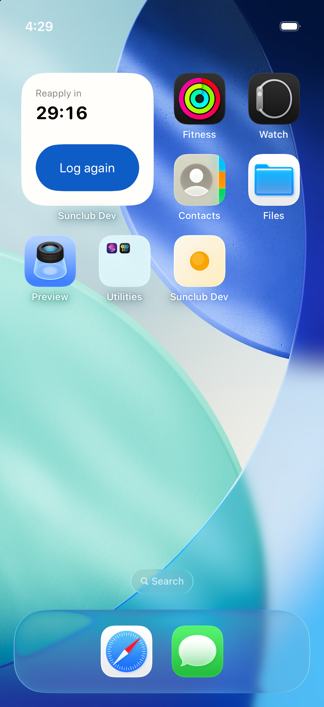
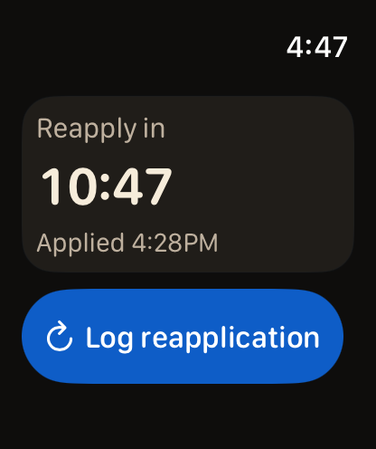
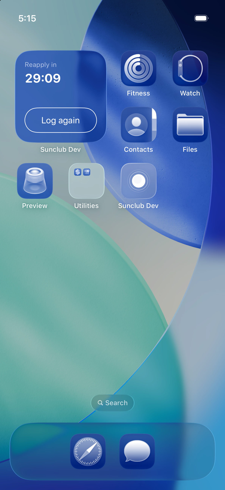

# Widget surfaces

Sunscreen status and logging lead the primary logging entry points. Widget status opens
Today; history opens History and totals open Insights. The small widget uses
“Log again” (or “Again” at larger text sizes) with the accessible name “Log reapplication.” All existing widget
kinds, supported families, fixed public intent semantics and legacy routes remain.

## Audit and verification

Captured on a signed SunclubDev build, iPhone 17 Pro simulator, iOS 26.5.
The unsigned baseline could display gallery previews but could not share the
app's snapshot; signed-build interaction checks use the shared app group.

| Step | Before | After |
| --- | --- | --- |
| Glance | Tiny action on textured empty space; logged state only a checkmark | Last application time or configured reapply timing |
| Log | Reapply presentation had no wired action | First application and reapplication both complete in place |
| Continue | Logged-state route did not reach Today | Status opens Today with the same recorded application time |
| Small button | Clipped setup label | Compact “Log again”; full accessible action name |

Automated coverage checks current-day state, early reapplication, reminders off,
rapid taps, failed persistence, superseded reminder work, midnight, sunset and
all shipped widget families. Live Activity timers no longer depend on high UV.

The visual checks cover the installed small widget, its Today route, synchronized
widget/Live Activity timer updates, and selected gallery previews: small/medium/large Sunscreen, small Logged Days,
medium Stats and medium History. The small widget also fits the largest accessibility
text setting with dark mode and increased contrast. Tinted mode uses an outlined
action to keep its label distinct from the system-tinted background. In-place
logging and synchronized timers were also checked in tinted mode. The Lock Screen
Live Activity fits at the largest text size, logs in place, and opens Today from
its status. Its compact Dynamic Island timer remains readable at that size.
A paired watchOS 26.5
simulator verifies the timer and logging action on the Watch home screen.
App-owned logging intents execute
in the app process so ActivityKit can update existing activities.
Physical Watch/offline delivery, OS refresh latency, and every widget family at
all accessibility sizes still require device acceptance testing. A simulator
screenshot does not establish full accessibility compliance.
