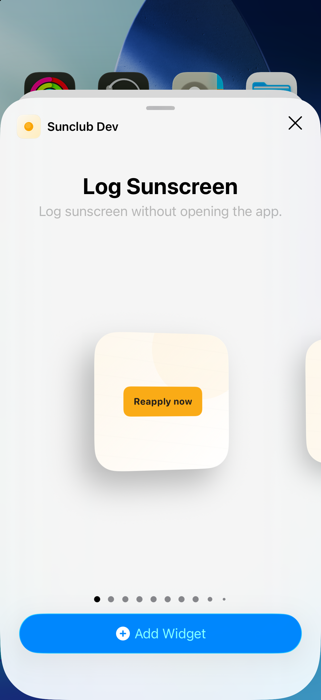
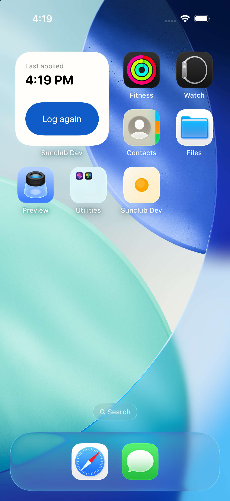

# Widget surfaces

Sunscreen status and logging lead every quick entry point. Widget status opens
Today; history opens History and totals open Insights. The small widget uses
“Log again” with the accessible name “Log reapplication.” All existing widget
kinds, supported families, fixed public intent semantics and legacy routes remain.

## Audit and verification

Captured on a signed SunclubDev build, iPhone 17 Pro simulator, iOS 26.5.
The unsigned baseline could display gallery previews but could not share the
app's snapshot; signed-build interaction checks use the shared app group.

| Step | Before | After |
| --- | --- | --- |
| Glance | Tiny action on textured empty space; logged state only a checkmark | Last application time or configured reapply timing |
| Log | Reapply presentation had no wired action | First application and reapplication both complete in place |
| Continue | Logged-state route did not reach Today | Status opens Today with the same recorded application time |
| Small button | Clipped setup label | Compact “Log again”; full accessible action name |

Automated coverage checks current-day state, early reapplication, reminders off,
rapid taps, failed persistence, superseded reminder work, midnight, sunset and
all shipped widget families. Live Activity timers no longer depend on high UV.

The visual checks above cover the installed small widget and its Today route.
Physical Watch/offline delivery, OS refresh latency, and every widget family at
all accessibility sizes still require device acceptance testing. A simulator
screenshot does not establish full accessibility compliance.
